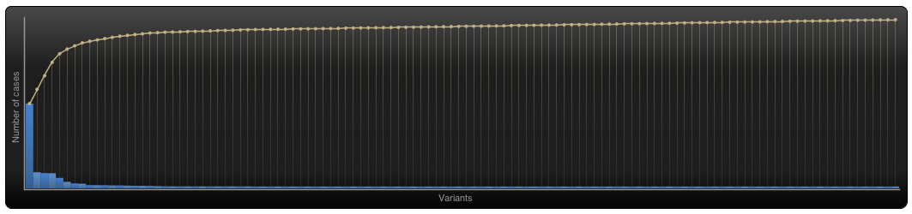
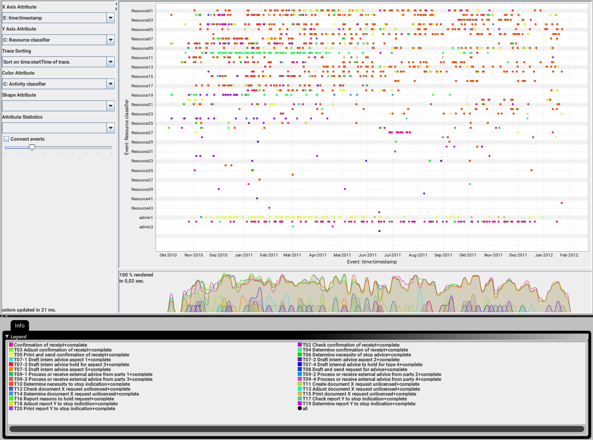

```{r setup, include=FALSE}
knitr::opts_chunk$set(echo = TRUE)
```

## Assignment: Applying Process Mining on Real Data

Give your project a descriptive title

---
  
Analysis of a Permit Application Process by Process Mining  
  
---

###  

**A** Open the event log ('Receipt phase of an environmental permit application process (_WABO_) CoSeLoG project.fbt') in Disco and switch to the 'Statistics' view.

Without switching to other views, use the statistics view to answer the following three subquestions:

1. How many events are there on average per case?
2. Can you indicate whether each case seems to be unique or whether many cases follow the same activity sequence?
3. What is the main observation that can be made from the 'Events over time' graph?

---

I did follow exactly the instructions for questions 1 to 3 and found: 

In the statistics view several graphs are shown, depending on a selection by button.
The default graph is labeled 'Events over time'. 

1. 8577 events found in 1434 cases, so on average there are 6 (8577 divided by 1434 = 5.98) events per case.

Switching to graph 'Case variants' we see:


  
  
2. About 50% of all cases follow one activity sequence, there are in total 116 sequence variants, with a total of 1434 cases.
  Most cases are *not* unique, but variants 31 to 116 are single case variants, so these cases follow a unique activity sequence.

Switching back to graph 'Events over time' 


3. We can see that the amount of activities per day is in a range of 0 to 147. There are many groups of 2 days or more with zero activities. Probably weekends and holidays. 

---


**B** While still in Disco, switch to the 'map' view to display a process map.

Using the map view, change the activity and path detail settings in order to create a comprehensible process map (e.g. a process map that could be printed on one A4 or letter paper or shown on a single computer screen while still being readable in full).

1. Discuss this process map, what is the main process?  
2. Which activities and paths between activities are frequent?  

In your answer, include the settings you used for both the activity and path sliders.

---

Switching to the process map pane a map for 100 percent of activities and 0 percent of path is shown. This map is not comprehensible, it contains too many different activities. On the other hand only a minor number of traces finish at the end event. So the number of activities has to be decreased and the number of paths increased.

The best compromise seems to be 50% of activities and 17% of paths. Now nearly 90% of traces finish at the end event and the most important activities are visible.

  
  

(The browser view of the map screenshot is not easy to read. But the proof printout in a A4 landscape format is.)

1. The major parts of the main process are 'Confirmation of receipt' and 'Determine necessity of stop'.  
'Confirmation of receipt' is self declaring, 'necessity of stop' not at all, so it is difficult to comprehend what might be stopped.

2. The main process consists of 2 groups of most frequent activities, conducted a few times parallel but most times in sequence:

    + Confirmation of receipt  
    + Check confirmation of receipt  
    + Determine confirmation of receipt  
    + Print and sent confirmation of receipt  
    
    + Determine necessity of stop advice  
    + Determine necessity of stop indication  
    
About 90 % of all cases contain these 6 activities. 
    
---

**C** While still in Disco, and while using the same process map (e.g. do not change the activity and path settings), switch to the performance projection.

1. Discuss where the process takes most time, e.g. where there are possibilities for improvement. Relate these times (of the bottlenecks) to the time spent in other parts of the process. In other words, discuss how severe the bottleneck is with respect to the time spent on other activities.

2. Also explicitly mention the performance metric chosen (e.g. total, mean, median, or max) and why you have chosen this setting.

---

- Switching to the performance projection.  
- Keeping the sliders at 50% activities and 17% path  
- Setting Show to 'Mean duration'  
- Adding as Secondary 'Absolute frequencies'  

we see:


1. Most time spent affecting a majority of cases is the "T06 determine necessity to stop advice activity" as can be seen in the graph, 3.1days in 791 events. If this could be shortend significantly, the response times would improve much and stake holders would have to wait much less.  
There are other even longer lasting events, but those are happening a lot less often so they are not significant as much as the above mentioned.  

2. Generally there are 2 important perspectives when analyzing process durations. 

    * Total durations of an activity for all cases is the relevant indicator if 
    you want to find out where most effort went into, which relates typically 
    which activities are the most expensive. Depending on whether these activities 
    are evenly distributed over many parallel workers or not the total duration 
    significantly indicates extraordinary long waiting times as well. 
    * Mean duration of activities and cases (full traces) is relevant if you 
    want to find out how long typically external stake holders of a case have to 
    wait until it is finished.  
    
    My focus here is on the external perspective - what are major factors for 
    long case run times?  
    
    In this process mining case study total time and long mean run time are found 
    at the same activity (79.6 mth, 791 activities). So adressing this in an 
    improvement process change would be benefitial for both external stake 
    holders and costs.
    
---

**D** Now load the original event log in ProM. Visualize the event log using the Dotted Chart or XDottedChart visualizer (by pressing the 'eye'-icon with the event log selected and switching to the Dotted Chart or XDottedChart visualizer).

Using the Dotted Chart, answer the following questions:

1. Is the arrival rate of new cases constant? If not, when are there fluctuations? If yes, how can we see this from the Dotted Chart?
2. Can you observe a change in the global process?

Note that you don't need to change the component, time or coloring settings. You can however re-sort the traces on the time of the first event, and zoom in or out if you want.

---

1. Loading the file Receipt phase of an environmental permit application process (_WABO_) CoSeLoG project.xes.gz into Prom67 and visualizing it by a Dotted Chart diagram and while sorting by time:startTime of Trace gives an overview of case start rate. Magnified here:  
  

From that diagram can be concluded: 

- there are small fluctuations in the arrival rate, there are no new cases on weekends. 
- there is a general trend for a slightly lower rate of new cases from around 20th of August

2. Looking at all traces we can see:

  

- there are less activities per case since about case 8800  
- the total time per trace looks shorter since then too  
- there are fewer very long running traces since 8800 as well   

this might have been caused by a change in the process handling within the organization  


---

**E** You are now asked to discover a Petri net on the event log. However, the unfiltered event log results in an incomprehensible Petri net. Therefore, you are allowed to run the 'Filter log using simple heuristics' plug-in once on the original event log to discover a Petri net on the filtered event log.

- Clearly indicate which settings you have used for the 'Filter log using simple heuristics' plug-in.
- Explicitly motivate the filtering settings chosen, why did you pick this percentage or selection of activities?
- Discuss and argue which plug-in (or chain of plug-ins) you have used to discover a Petri net, for instance by comparing two or more plug-in results and arguing why one of the Petri nets is better.
- Explain the (best) Petri net: what is the main process and what are notable parts of the Petri net?

Note that this question requires you to experiment with different filtering settings and discovery plug-ins. You are not required to describe everything you have tried but found unsuccessful. Only describe the successful combination of plug-ins and its result(s) and argue why your final result is 'good'.

Suggested list of plug-ins or plug-in chains to produce a Petri net:

- Mine for a Petri Net using Alpha-algorithm
- Mine for a Petri Net using ILP
- Mine for a Heuristics Net using Heuristics Miner followed by Convert Heuristics net into Petri net
- Mine for a Petri net with Inductive Miner

  
---

The essential step to discover a comprehensible Petri net from the supplied log data is to filter out classes of traces with only a few class members but which are complicating the process model without giving extra insights. The major challenge is setting the filters to such a level that an optimum of the real process variants is captured. Whether a class of traces is included or not for a good process model should not depend on miner chosen for a Petri net. But there are differences in features a process discovery method is able to guarantee. Book chapter 7.5 "Inductive Mining" states "process trees are sound by construction".  
So a good starting point is using the Inductive Visual Miner Plugin within ProM to discover a process tree and convert it to a Petri net thereafter.

Steps  

1. Apply Inductive Visual Miner Plugin to the data set with default settings.  
2. Convert the Process tree to a Petri net  
3. Evaluate the Petri net  
4. If Petri net is satisfactory - finish  
5. Set pre mining filter to get a more comprehensible tree  
6. Repeat loop from step 2.  

We see:

2. with defaults:  
      

3. The Petri net is not comprehensible, it contains many hidden nodes  

5. Set the trace prefilter to only include 90% of the most occurring traces  
      
    
Now the Petri net is comprehensible. Iteratively we can arrive to an optimal prefilter of 92.2% of the most occuring traces. That gives  
  

which is a result of this mined model, with parameters set up to be verified on screencopy.

  
  
  
This Petri net is easy to comprehend and contains only 3 hidden nodes.  
A tiny inrease of one-tenth more traces results in an increase to 10 hidden nodes with incomprehensible control flow.  
  
So the 92.2 percent setup is the optimal filter.  

Nearly as good results can be achieved with other miners, but none gave a better net and none could be used to find the optimal filter settings for the best compromise of detail and drop of distorting traces.  

See PhD thesis about Inductive miner: [Robust Process Mining with Guarantees](https://pure.tue.nl/ws/files/63890938/20170509_Leemans.pdf)  
  
---
  

**F** The organization has a process model that describes the 'should be' process (i.e. a normative process model). Load the file 'normativeModel.pnml' into ProM and apply conformance checking on this process model, and on the full unfiltered original event log.

Include a screenshot of the part of the normative process model, with the conformance information projected onto it, that shows where most of the deviations occur.
What is the replay fitness (the 'trace fitness' statistic) of the event log on the normative process model?
Select the transition 'T06 Determine necessity of stop advice+complete' (on the top left of the model) and discuss its element statistics: how many times is the transition executed correctly and how many times incorrectly?
Using the element statistics of transition 'T06 Determine necessity of stop advice+complete', what can you say about the (in)correct execution of this activity?  
  
Instructions to align the process model with the event log:

Import the normative model using the `PNML Petri net files` importer.
Select the imported normative Petri net and the event log, start the plug-in called `Replay a Log on Petri Net for Conformance Analysis` (not the variant with performance!), and click `yes` in the `No Final Marking` pop-up.
Select the 'sink' place on the left (note: do not select '0-sink' etc.) and click the button 'Add Place >>' to add the place 'sink' to the candidate final marking list. Now click 'Finish'.
Click 'Finish' in the mapping wizard.
Click 'No, I've mapped all necessary event classes' to indicate that some events are not present in the normative model.
Now click 'Next' and 'Finish'. The normative process model is shown with conformance information projected onto it.
  
If you followed these instructions exactly you do not need to mention these steps in your answer.
  
---  

The part of the model where the most (absolute, not relative) deviations occur:  
  

The trace fitness is calculated as 0.8425  
  

The overall statistics of the replay are:  

Stat | Value  
----|---  
#Cases replayed | 1.434
#Synchronous ev.class (log+model) | 6.887
#Skipped ev.class | 543
#Unobservable ev.class | 10.287
#Inserted ev.class | 1.690
#Violating synchronous ev.class | 0
  
  
The screenshot also shows the T06 element statistics of 1309 traces where move log and modul occur and 125 traces with move model only.  

So 8.7% of all traces show a deviation between from the model.  


---

**G** The final analysis you have to perform on the original event log is a resource analysis, e.g. looking at the user behavior in the event log.

Use the plug-in 'Mine for a Subcontracting Social Network'. Note that subcontracting means that if individual *j* frequently executed an activity in-between two activities executed by individual *i*, then individual *i* subcontracted work to individual *j*. 

Answer the following question using this view: 

1. Can two or more groups of users be distinguished? Explicitly discuss the settings you have used in the resulting visualization.  
  
---  
  
Applied the plug-in.  
Non-default settings choosen:

1. Ranking: "Betweenness"  it shows ressources acting in-between  
2. Edge removed for - to get distingushing colors  
3. Size by ranking - to display the in-betweeness by size  


  
We can distinguish 3 types of resource involvement:

1. With big subcontracting involvement, e.g. Resource 24, 02, 12, 08, ...  
2. Several with some subcontracting, e.g. 33, 15, 13, ...., admin, ...   
3. Many with no subcontracting at all. 36, 30, 2, ...   


---  


**H** Again use one of the two Dotted Chart plug-ins. For the XDottedChart change the component type to 'org:resource'. If you use the Dotted Chart visualizer change the 'Y Axis Attribute' to 'C: Resource classifier' and the color attribute to 'C: Activity Classifier'. 

Answer the following two questions using this view:

1. Are all users executing activities from the start of the event log, or are some users joining later?
2. Are users mainly executing particular activities or are most users executing most of the activities?

---
  
Doing as instructed we get:  
  
  
  
we can conclude:  

1. A few resources were active only later, e.g. 03 since Sept. 2011. 
2. Some resources are involved only in one or very few differnt activities. E.g. admin1 = T05.  
3. About half of the resources are active most times, the other half only occasionally.  
4. Some conducted only one activity at all.  

---


**J** To conclude this assignment, briefly discuss three observations you have made during your analysis that you would like to communicate to the business user.

Think for instance of possible improvement opportunities and starting points for further investigation.

---
  
1. Having 116 trace variants and about 75 percent of these being followed only once suggests many very individual case handlings not really following a normative model. Reasons for this should be investigated. A more streamlined handling may be a lot more effective.  

2. There is much effort spent in T06. Optimization of this will reduce costs and waiting times for stake holders significantly.  

3. A change in processing might have happend since August 2011. This should be further investigated by splitting the log into 2 parts and mining them separately. Comparing activities, times etc might suggest where improvements allready have been achieved and point 1 and 2 might be seen in a different perspective.  

  
---
